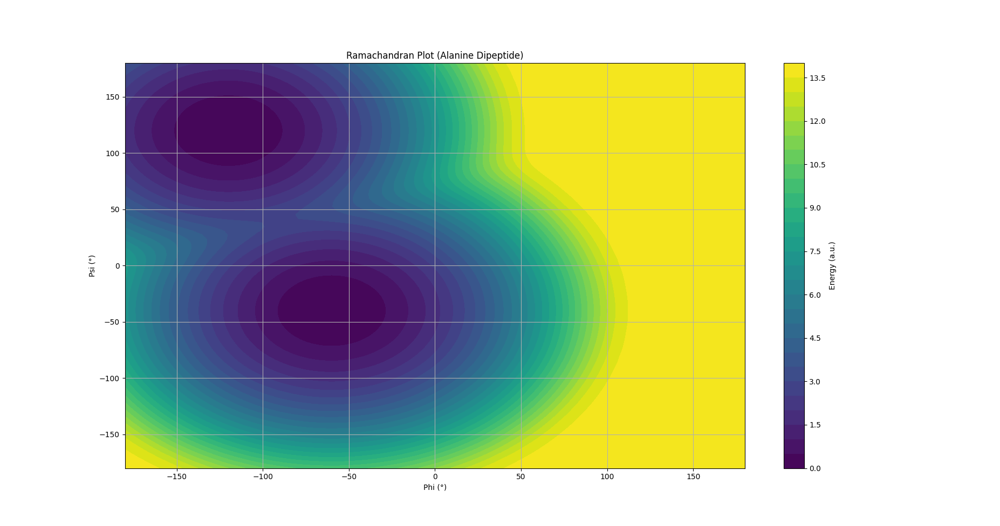

# Ramachandran Plot Analysis of Alanine Dipeptide


> Modeling protein backbone conformations using Ramachandran plots and computational energy landscapes.

---

##  Overview

This project explores the backbone conformations of **alanine dipeptide** by analyzing φ (phi) and ψ (psi) dihedral angles.

Two approaches were implemented:

* Molecular simulation attempt using OpenMM
* Analytical modeling of conformational energy landscape

---

##  Why This Project Matters

Understanding protein backbone conformations is fundamental to:

* Protein folding studies
* Drug design
* Structural bioinformatics

Alanine dipeptide serves as a minimal model system to explore these concepts computationally.

---

##  Objectives

* Construct alanine dipeptide structure
* Measure backbone dihedral angles
* Generate Ramachandran plot
* Identify α-helix and β-sheet regions
* Model conformational energy landscape

---

## ⚙️ Tools & Technologies

*  Avogadro — molecular structure building
*  OpenMM — molecular simulation
*  MDTraj — dihedral angle analysis
*  Python (NumPy, Matplotlib) — computation & visualization

---

##  Methodology

### 1. Structure Preparation

* Built alanine dipeptide in Avogadro
* Ensured correct peptide bond geometry

### 2. Dihedral Angle Analysis

* Measured φ and ψ angles
* Observed extended conformation (~180°)

### 3. Simulation Attempt (OpenMM)

* Attempted MD simulation setup
* Encountered forcefield limitation (`UNL residue`)

### 4. Final Approach (Analytical Model)

* Generated φ and ψ values across full range
* Computed energy using simplified function
* Visualized conformational landscape

---

##  Skills Demonstrated

* Molecular structure modeling
* Computational simulation setup (OpenMM)
* Structural analysis using MDTraj
* Data visualization (Matplotlib)
* Scientific problem solving & debugging
* Git & GitHub version control

---

##  Results

 Shows clustering in:

* **α-helix region**
* **β-sheet region**

---

### Energy Contour Plot


 Represents:

* Stable conformations (low energy regions)
* Allowed conformational space

---

## Interpretation

* Dense clusters indicate energetically favorable conformations
* α-helix region (~ -60°, -40°) is clearly observed
* β-sheet region (~ -120°, 120°) is also present
* Energy contour highlights stable conformational basins

These results align with known protein backbone behavior.

---

## Challenges & Learnings

* OpenMM requires properly defined residues (ACE–ALA–NME)
* Non-standard residues cause forcefield errors
* Ramachandran plots require multiple conformations, not a single structure
* Analytical models can approximate conformational landscapes effectively

---

## Limitations

* OpenMM simulation was limited by non-standard residue definitions
* Analytical model approximates energy rather than computing it explicitly
* Single-molecule system lacks full protein context

---

## Future Work

* Perform full MD simulation with proper residue parameterization
* Generate trajectory-based Ramachandran plots
* Compare with experimental protein datasets
* Extend analysis to larger peptides/proteins

---

##  How to Run

```bash
pip install -r requirements.txt
python ramachandran_model.py
```

---

## Project Structure

```
ramachandran_project/
│
├── ala.pdb
├── ramachandran_model.py      # Final working model
├── ramachandran_openmm.py     # Initial simulation attempt
├── requirements.txt
└── README.md
```

---

## Author

**Sarah Nadeem**
MSc Computational Biology

---

If you found this project useful, feel free to star the repository!
---
##  Sample Output


